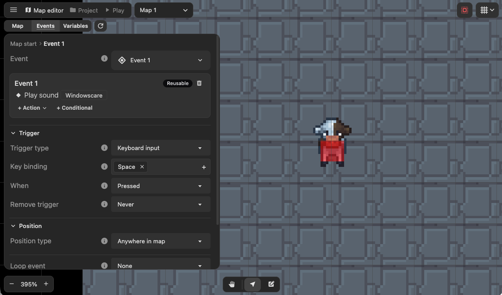
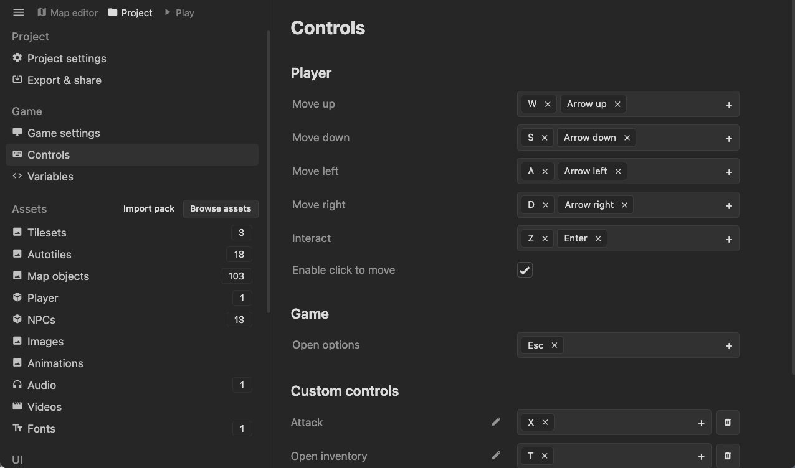
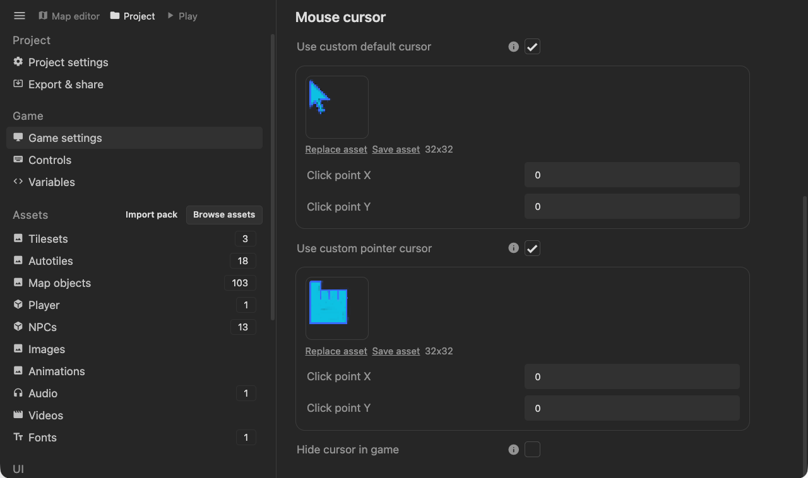

Hey everyone!

Today we are releasing an update that adds more ways to trigger events! There are new mouse input and keyboard input trigger types, which let you trigger an event when the player clicks something or when they press a keyboard key.

You can also continuously trigger an event while the player holds down a key or mouse button.

Along with those triggering methods, I also added a way to customize the existing key binds, such as player movement and the interaction key.

You'll be able to customize what the mouse cursor looks like in game as well.

These new features open up a lot of possibilities! Some I can think of are:

- Point and click adventure games
- Action battle sequences with NPC enemies and an attack button
- Opening a quest UI with a button

I also updated the [event trigger guide](/event-system/event-triggers/), which includes how to use these custom keybinds.

Hope you guys like the update and I’m excited to see what you make!
